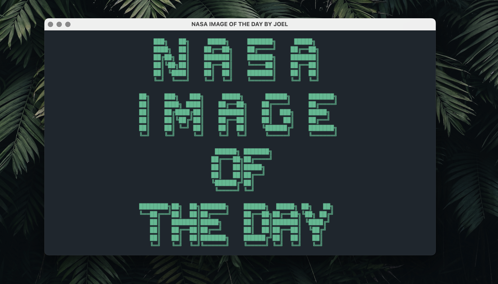

					███╗   ██╗ █████╗ ███████╗ █████╗     ██╗███╗   ███╗ █████╗  ██████╗ ███████╗
					████╗  ██║██╔══██╗██╔════╝██╔══██╗    ██║████╗ ████║██╔══██╗██╔════╝ ██╔════╝
					██╔██╗ ██║███████║███████╗███████║    ██║██╔████╔██║███████║██║  ███╗█████╗
					██║╚██╗██║██╔══██║╚════██║██╔══██║    ██║██║╚██╔╝██║██╔══██║██║   ██║██╔══╝
					██║ ╚████║██║  ██║███████║██║  ██║    ██║██║ ╚═╝ ██║██║  ██║╚██████╔╝███████╗
					╚═╝  ╚═══╝╚═╝  ╚═╝╚══════╝╚═╝  ╚═╝    ╚═╝╚═╝     ╚═╝╚═╝  ╚═╝ ╚═════╝ ╚══════╝
					 ██████╗ ███████╗    ████████╗██╗  ██╗███████╗    ██████╗  █████╗ ██╗   ██╗
					██╔═══██╗██╔════╝    ╚══██╔══╝██║  ██║██╔════╝    ██╔══██╗██╔══██╗╚██╗ ██╔╝
					██║   ██║█████╗         ██║   ███████║█████╗      ██║  ██║███████║ ╚████╔╝
					██║   ██║██╔══╝         ██║   ██╔══██║██╔══╝      ██║  ██║██╔══██║  ╚██╔╝
					╚██████╔╝██║            ██║   ██║  ██║███████╗    ██████╔╝██║  ██║   ██║
					 ╚═════╝ ╚═╝            ╚═╝   ╚═╝  ╚═╝╚══════╝    ╚═════╝ ╚═╝  ╚═╝   ╚═╝

This program is an attempt to connect to a publicly available NASA API 
and display an image from that information.

<<<<<<< HEAD

=======
![Screenshot][Screenshot.png]
>>>>>>> 9b3df30617ae79e6774eba3bd8792c729a6777b8
